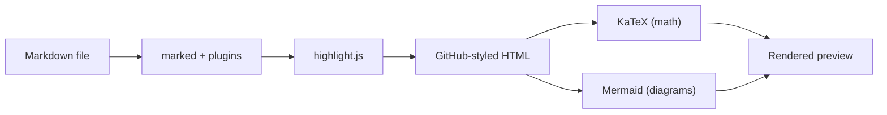

# ghmd — GitHub Markdown Preview

**Pixel-perfect GitHub rendering, locally.** Works as a standalone server (browser) and a VS Code extension.

   

---

## Why GHMD?

| | GHMD | Built-in Preview | MPE |
|---|:---:|:---:|:---:|
| GitHub-accurate rendering | Yes | No | Approximate |
| Alerts, footnotes, math, mermaid | All | None | All |
| Install size | 1.5 MB | Built-in | ~50 MB |
| Config required | Zero | Zero | Extensive |
| Standalone server | Yes | No | No |

---

## Features

| Feature | Syntax |
|---------|--------|
| GitHub Alerts | `> [!NOTE]`, `> [!TIP]`, `> [!IMPORTANT]`, `> [!WARNING]`, `> [!CAUTION]` |
| Mermaid diagrams | ` ```mermaid ` (flowchart, sequence, gantt, class, state, ER, pie, git) |
| LaTeX math | `$...$` inline, `$$...$$` block |
| Code highlighting | ` ```lang ` with highlight.js |
| Diff highlighting | ` ```diff ` with `+`/`-` lines |
| Collapsible sections | `<details>` / `<summary>` |
| Footnotes | `[^label]` |
| Task lists | `- [x]` / `- [ ]` |
| Keyboard keys | `<kbd>Cmd</kbd>` |
| Sub/superscript | `<sub>` / `<sup>` |
| Theme-aware images | `<picture>` with `prefers-color-scheme` |
| Light/dark toggle | Toolbar button, persisted |
| Table of contents | Collapsible TOC panel |
| Live reload | Auto-updates on file change |

---

## Install

```bash
git clone git@github.com:Ubpa/ghmd.git
cd ghmd
npm install
```

---

## Usage

### Standalone Server

```bash
node serve.mjs README.md              # http://localhost:6419
node serve.mjs docs/guide.md 8080     # custom port
```

Auto-reloads in browser on file change. KaTeX and Mermaid load from CDN.

<details>
<summary>Offline mode</summary>

```bash
node serve.mjs --init                  # one-time: downloads katex + mermaid
node serve.mjs README.md              # now fully offline
```

</details>

### VS Code Extension

#### Install

```bash
npm run package                        # build + create .vsix
code --install-extension ghmd-0.1.0.vsix
```

#### Keybindings

| Shortcut | Action |
|----------|--------|
| <kbd>Cmd</kbd>+<kbd>K</kbd> <kbd>V</kbd> | Open preview to the side |
| <kbd>Shift</kbd>+<kbd>Cmd</kbd>+<kbd>V</kbd> | Open preview (same tab) |

> [!TIP]
> The preview automatically follows your active markdown editor — no need to reopen when switching files.

The extension replaces the built-in markdown preview button with the GitHub icon. Theme toggle and TOC panel are in the top-right corner.

---

## How It Works



Both entry points share the same pipeline:

1. **marked** parses GFM with alert and footnote plugins
2. **highlight.js** handles code syntax highlighting
3. **github-markdown-css** provides GitHub's exact styling
4. **KaTeX** renders math client-side
5. **Mermaid** renders diagrams client-side

> [!NOTE]
> The standalone server loads KaTeX/Mermaid from CDN by default (or locally after `--init`). The VS Code extension bundles everything into a 1.5 MB `.vsix`.

---

## Development

```bash
npm install                            # install dependencies
npm run build                          # bundle extension + vendor assets
npm run dev                            # build with sourcemaps (F5 debugging)
npm run package                        # build + create .vsix
npm test                               # run VS Code e2e tests (headless)
```

<details>
<summary>Project structure</summary>

```
ghmd/
  serve.mjs             Standalone server (ESM, zero build step)
  src/
    extension.cjs       VS Code extension source (CJS, bundled by esbuild)
    ui.css              Shared UI styles (SSOT for both entry points)
    toc.js              Shared TOC logic (SSOT for both entry points)
  scripts/vendor.mjs    Copies dist files from node_modules → vendor/
  dist/                 Bundled extension output (gitignored)
  vendor/               Runtime assets for extension (gitignored)
  docs/                 Research and roadmap
```

</details>

<details>
<summary>Updating dependencies</summary>

```bash
npm update                             # update node_modules
npm run build                          # rebuild vendor/ + dist/
npm run package                        # create new .vsix
```

</details>
