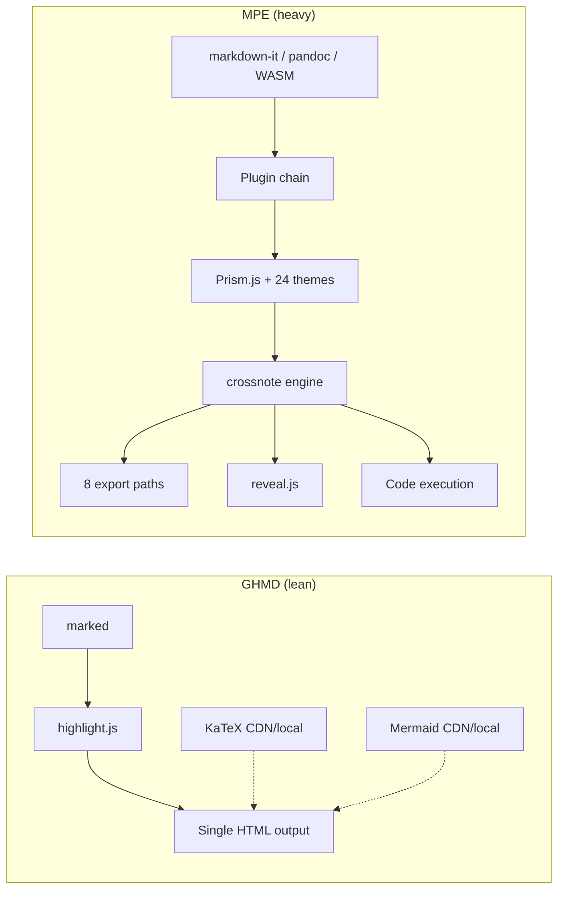
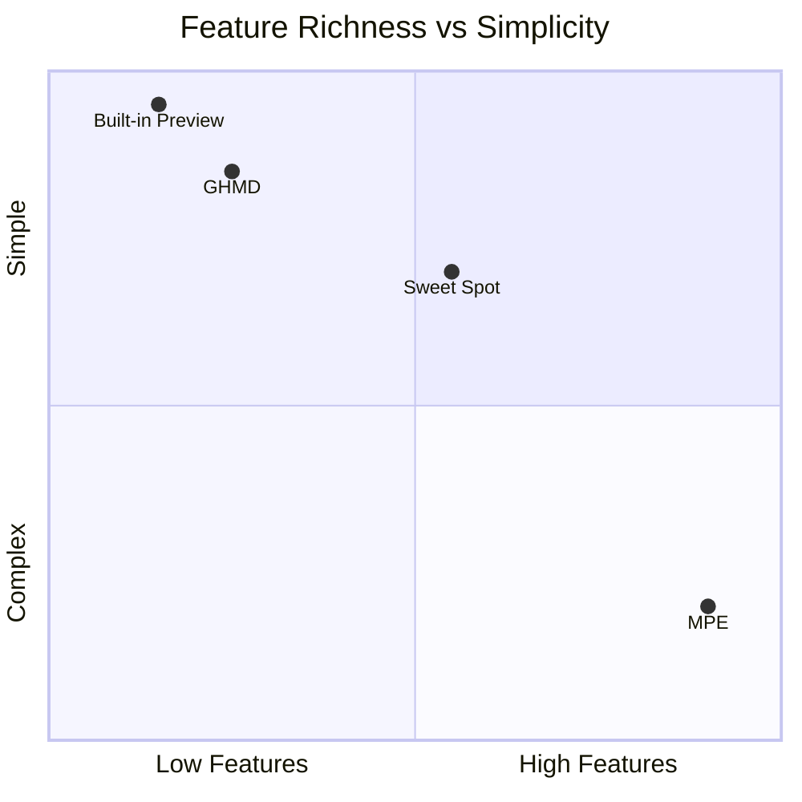

# GHMD vs Markdown Preview Enhanced — Competitive Research

> A focused analysis of where GHMD stands against the most popular third-party markdown previewer, and what strategic direction makes GHMD win.

---

## Executive Summary

| Dimension | GHMD | MPE |
|-----------|:----:|:---:|
| GitHub rendering fidelity | Pixel-perfect | Approximate theme |
| VSIX size | **1.5 MB** | ~50 MB |
| Startup time | Instant | Noticeable lag |
| Zero-config experience | Yes | Requires setup |
| Standalone server mode | Yes | No |
| Diagram types | 1 (Mermaid) | 12+ |
| Export formats | None | 8 paths (PDF, HTML, ePub...) |
| Scroll sync | No | Bidirectional |
| Code execution | No | Yes (Python, bash, etc.) |
| Customization depth | Minimal | Extreme (themes, parser hooks, CSS) |

> [!IMPORTANT]
> GHMD's core advantage is **accuracy + speed + simplicity**. The strategy should be: add the 20% of features that cover 80% of user needs, without becoming another MPE.

---

## Feature Gap Analysis

### Rendering Features

| Feature | GHMD | MPE | Priority |
|---------|:----:|:---:|:--------:|
| GFM parsing | marked | markdown-it / pandoc / WASM | -- |
| GitHub Alerts | Yes | Yes | -- |
| Footnotes | Yes | Yes | -- |
| KaTeX math | Yes | KaTeX or MathJax | -- |
| Mermaid diagrams | Yes | Yes | -- |
| Code syntax highlight | marked-highlight + hljs | Prism.js (24 themes) | -- |
| YAML front matter | Yes (marked-frontmatter) | Yes | -- |
| Auto-link URLs | Yes (marked-linkify-it) | Yes | -- |
| PlantUML | No | Yes (local JAR or server) | Medium |
| GraphViz | No | Yes (Viz.js, no Java) | Medium |
| D2 diagrams | No | Yes (CLI) | Low |
| TikZ / LaTeX | No | Yes | Low |
| WaveDrom / Bitfield | No | Yes | Skip |
| Vega / Vega-lite | No | Yes | Skip |
| Kroki gateway | No | Yes | Low |
| Emoji shortcodes | Yes (gemoji) | Yes | -- |
| CriticMarkup | No | Yes | Skip |
| Wiki links | No | Yes | Skip |
| Definition lists | No | Yes | Skip |
| Extended table merge | No | Yes | Skip |

### Editor Integration

| Feature | GHMD | MPE | Priority |
|---------|:----:|:---:|:--------:|
| Live update on edit | Yes | Yes (configurable debounce) | -- |
| Follow active editor | Yes | Yes ("Single Preview" mode) | -- |
| Scroll sync (editor ↔ preview) | **No** | Bidirectional | **High** |
| Image paste from clipboard | **No** | Yes (with upload) | **High** |
| Preview zoom in/out | **No** | Yes (<kbd>Cmd</kbd>+<kbd>=</kbd>/<kbd>-</kbd>) | Medium |
| Insert table/pagebreak commands | No | Yes | Low |
| Auto-show on markdown open | No | Yes (configurable) | Low |
| Graph view (doc relationships) | No | Yes | Skip |
| Backlinks | No | Yes | Skip |

### Export

| Feature | GHMD | MPE | Priority |
|---------|:----:|:---:|:--------:|
| Export to HTML | **No** | Yes (offline/CDN) | **High** |
| Export to PDF | **No** | Yes (Chrome/Puppeteer) | **High** |
| Export to Word/RTF | No | Yes (Pandoc) | Low |
| Export to ePub/Mobi | No | Yes (Calibre) | Skip |
| reveal.js presentations | No | Yes | Skip |
| Export on save | No | Yes | Medium |

### Customization

| Feature | GHMD | MPE | Priority |
|---------|:----:|:---:|:--------:|
| Preview themes | 2 (light/dark GitHub) | 17 themes | Low |
| Code block themes | 2 (GitHub light/dark) | 24 themes | Low |
| Custom CSS / LESS | No | Yes (global + workspace) | Low |
| Parser extension hooks | No | Yes (pre/post parse JS) | Skip |
| Custom HTML head injection | No | Yes | Skip |
| Configurable math delimiters | No | Yes | Low |

---

## Architecture Comparison

> [!TIP]
> GHMD's single-pipeline architecture is a strength, not a weakness. Every feature added should compose into this pipeline, not bolt on a parallel system.

---

## Strategic Positioning

### The "Sweet Spot" Target

GHMD should move toward the sweet spot: **enough features for daily work, zero configuration burden**. This means:

1. **Scroll sync** — the single most-requested feature for any markdown previewer
2. **HTML export** — GHMD already generates the full HTML, just needs a "Save" command
3. **PDF export** — piggyback on Chrome/Puppeteer, the standard approach
4. **Image paste** — massive productivity gain for documentation writers
5. **Preview zoom** — trivial to implement, frequently needed

### What NOT to build

> [!CAUTION]
> These features would bloat GHMD without meaningful user gain:

- **Code execution** — security nightmare, niche audience, better served by Jupyter
- **Multiple parser engines** — over-engineering; marked handles GFM perfectly
- **reveal.js presentations** — separate tool territory (Slidev, Marp)
- **eBook export** — Calibre/Pandoc do this better standalone
- **Wiki links / CriticMarkup** — niche syntax with tiny user base
- **17 preview themes** — GHMD's value IS pixel-perfect GitHub; adding themes dilutes that
- **Parser hooks / custom head injection** — extensibility for extensibility's sake

---

## Competitive Moat

GHMD's defensible advantages that MPE cannot easily replicate:

| Advantage | Why it's hard to copy |
|-----------|----------------------|
| Pixel-perfect GitHub CSS | MPE uses approximate themes; matching GitHub exactly requires using `github-markdown-css` directly |
| 1.5 MB install | MPE's crossnote engine + 12 diagram libs make it fundamentally heavy |
| Standalone server | MPE is VS Code-only; GHMD works in any browser |
| Zero config | MPE has 50+ settings because its features demand them |
| Fast startup | Less code = less to load. Simple architecture wins on performance |

> The goal is not to match MPE feature-for-feature. The goal is to be the **best GitHub-accurate previewer** that also handles the features people actually use daily.

---

## Key Metrics to Track

$$
\text{User Value} = \frac{\text{Features Used Daily}}{\text{Setup Time} + \text{Config Complexity}}
$$

GHMD should maximize this ratio. Every feature added must pass the test: *"Will most users use this most days?"*

---

## References

- [Markdown Preview Enhanced](https://github.com/shd101wyy/vscode-markdown-preview-enhanced) — 3.8M+ installs
- [github-markdown-css](https://github.com/sindresorhus/github-markdown-css) — GHMD's styling foundation
- [VS Code Webview API](https://code.visualstudio.com/api/extension-guides/webview) — constraints on extension previews

[^1]: Install counts as of May 2026 from VS Code Marketplace.
