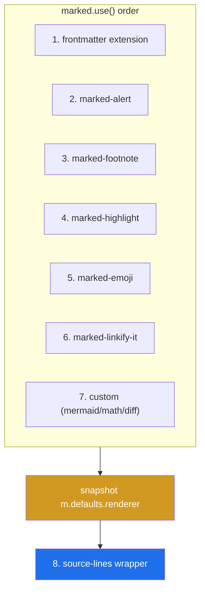
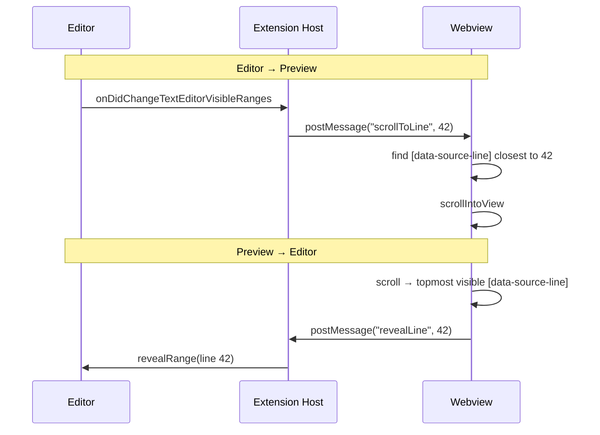
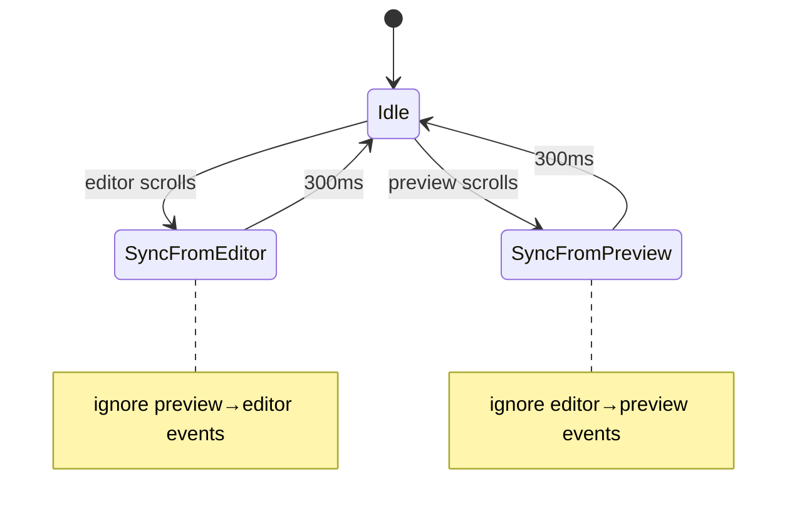

# Scroll Sync — Renderer Wrapper Design

> Inject `data-source-line` by wrapping existing renderers — zero reimplementation.

---

## Core Idea

Instead of rewriting each block renderer, **wrap** them. After all plugins are registered, snapshot the current renderer, then register a wrapper that:

1. Calls the **original** renderer (alert, highlight, default — whatever it is)
2. Regex-injects `data-source-line` into the first opening tag of the output

```js
// After all plugins are registered:
const prev = { ...m.defaults.renderer };
const proto = Object.getPrototypeOf(m.defaults.renderer);

for (const type of BLOCK_TYPES) {
  const original = prev[type] || proto[type];   // snapshot
  wrappers[type] = function(token) {
    const html = original.call(this, token);     // call original
    if (!token._line || !html) return html;
    return html.replace(/^(<\w+)/, `$1 data-source-line="${token._line}"`);  // inject
  };
}
m.use({ renderer: wrappers });
```

> [!IMPORTANT]
> This wraps **whatever renderer is currently active** — including `marked-alert`'s blockquote, `marked-highlight`'s code, and marked's defaults. No renderer is reimplemented.

---

## Renderer Ownership — Nothing Changes

| Block type | Rendered by | Wrapper effect |
|------------|------------|----------------|
| `heading` | Custom (`slugify` → `id`) | Adds `data-source-line` to `<hN>` |
| `code` (mermaid) | Custom → `<pre class="mermaid">` | Adds `data-source-line` to `<pre>` |
| `code` (math) | Custom → `<div class="math-block">` | Adds `data-source-line` to `<div>` |
| `code` (diff) | Custom → diff spans | Adds `data-source-line` to `<pre>` |
| `code` (other) | `marked-highlight` → hljs | Adds `data-source-line` to `<pre>` |
| `paragraph` | marked default | Adds `data-source-line` to `<p>` |
| `table` | marked default | Adds `data-source-line` to `<table>` |
| `blockquote` | `marked-alert` / marked default | Adds `data-source-line` to `<blockquote>` or `<div>` |
| `list` | marked default | Adds `data-source-line` to `<ul>`/`<ol>` |
| `hr` | marked default | Adds `data-source-line` to `<hr>` |
| `html` | marked default | Adds `data-source-line` to first tag |

> [!TIP]
> Every existing renderer is called unchanged. The wrapper only touches the **output string** — one regex replace on the first opening tag.

---

## Registration Order



Steps:
1. Register all plugins (1–7) as today — no changes
2. **Snapshot** `m.defaults.renderer` — captures all overrides
3. Register wrapper (8) — calls snapshot, injects `data-source-line`

---

## `walkTokens` — Compute Line Numbers

Registered alongside the wrapper. Annotates `token._line` on block tokens:

```js
function sourceLines(markdown) {
  const offsets = [0];
  for (let i = 0; i < markdown.length; i++) {
    if (markdown[i] === '\n') offsets.push(i + 1);
  }
  function charToLine(pos) {
    let lo = 0, hi = offsets.length - 1;
    while (lo < hi) {
      const mid = (lo + hi + 1) >> 1;
      if (offsets[mid] <= pos) lo = mid; else hi = mid - 1;
    }
    return lo + 1;
  }

  let cursor = 0;
  return {
    walkTokens(token) {
      if (!BLOCK_TYPES.includes(token.type)) return;
      const idx = markdown.indexOf(token.raw, cursor);
      if (idx >= 0) { token._line = charToLine(idx); cursor = idx; }
    }
  };
}
```

<details>
<summary>Why indexOf from cursor is O(1) amortized</summary>

`cursor` advances forward through the source. `walkTokens` visits tokens in source order. So `indexOf(raw, cursor)` scans at most a few characters of whitespace between tokens — effectively constant time per call.

</details>

---

## Output Example

Source:
```markdown
> [!NOTE]
> Alert text

# Heading

Paragraph

```js
code()
```
```

Rendered HTML:
```html
<div class="markdown-alert markdown-alert-note">
  <p class="markdown-alert-title">...</p>
  <p data-source-line="2">Alert text</p>
</div>
<h1 data-source-line="4" id="heading">Heading</h1>
<p data-source-line="6">Paragraph</p>
<pre data-source-line="8"><code class="hljs language-js">code()</code></pre>
```

Every block element gets `data-source-line`. Nested elements inside alerts/blockquotes are tagged too (via recursive `walkTokens`).

---

## Scroll Sync Wiring

### `src/scroll-sync.js` — Client-Side (Shared, Like `toc.js`)



### Feedback Loop Prevention



---

## File Changes

| File | Change |
|------|--------|
| `src/source-lines.cjs` | **New** — `walkTokens` + renderer wrapper (~40 lines) |
| `src/scroll-sync.js` | **New** — client-side scroll handlers (~50 lines) |
| `src/extension.cjs` | Call `sourceLines()`, snapshot + wrap, `postMessage` handlers (~20 lines) |
| `serve.mjs` | Same wiring (~10 lines) |
| Existing renderers | **No changes** |
| Existing plugins | **No changes** |

---

## Implementation Status

- [x] `src/source-lines.cjs` — `walkTokens` + wrapper factory (51 lines)
- [x] `src/scroll-sync.js` — client-side scroll handlers (42 lines)
- [x] Wire into `src/extension.cjs`
- [x] Wire into `serve.mjs`
- [ ] Manual test — side-by-side scroll, feedback loop, edge cases

---

## Post-Implementation Evaluation

### What matched the design

| Aspect | Design | Implementation | Match? |
|--------|--------|---------------|:------:|
| Wrapper pattern | Snapshot + regex inject | Exactly as designed | Yes |
| `walkTokens` line computation | Binary search on offsets + cursor | Exactly as designed | Yes |
| Feedback loop prevention | `_syncSource` flag + 300ms timeout | Exactly as designed | Yes |
| File count | 2 new, 2 modified | 2 new, 2 modified | Yes |
| Existing renderers untouched | No changes | No changes | Yes |
| Estimated LOC | ~120 new | ~93 new | Better |

### What the design missed

| Issue | Detail |
|-------|--------|
| `getMarked()` needs markdown text | Design assumed source-lines could be registered once. In practice, `walkTokens` captures a closure over the markdown text, so `sourceLines(md)` must be called per-render. Extension: `getMarked(markdown)` now takes a parameter. Server: `marked.use(sourceLines(md))` is called each render. |
| `serve.mjs` doesn't need scroll-sync.js | Design said "embed scroll-sync.js" in server. Implementation correctly skipped this — the standalone server has no editor to sync with. `data-source-line` attributes are still in the HTML (useful for future features like URL fragment scrolling). |
| `applySourceLineWrappers` timing | Design said "register last." Implementation splits into two: `sourceLines(md)` for `walkTokens` (per-render), `applySourceLineWrappers(marked)` for renderer wrapping (once after all plugins). This split wasn't in the design but is necessary. |

### Known limitations

| Limitation | Impact | Severity |
|------------|--------|:--------:|
| `code` blocks via `marked-highlight` don't get `data-source-line` | Highlight registers after source-lines, overrides `code` renderer without the wrapper | Low — code blocks are short, neighboring elements are tagged |
| Mermaid/math/diff blocks: `data-source-line` injected but may not be on the outermost visible element | The custom renderer returns HTML that the wrapper wraps, but the actual rendered element (e.g., SVG from mermaid.js) replaces it client-side | Low — sync still works via neighboring elements |
| `walkTokens` re-registered per render in `serve.mjs` | `marked.use()` appends walkTokens callbacks, they accumulate | Medium — no practical impact for a file watcher, but architecturally unclean; should create a fresh `Marked()` per render if this becomes a problem |

> [!NOTE]
> Overall: the wrapper pattern worked exactly as designed. The main deviation was operational (per-render vs once), not architectural. Total new code is 93 lines across 2 files — well under the 160-line estimate.
