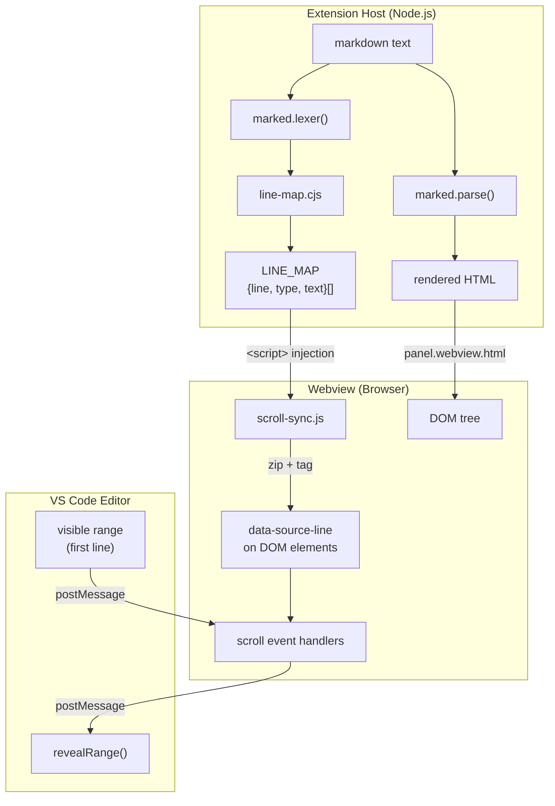
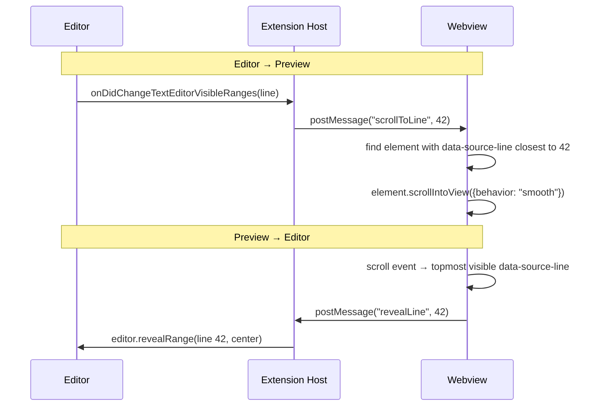

# Scroll Sync — Design Document

> Map editor cursor position to preview scroll position (and back) without touching the rendering pipeline.

---

## The Problem

When the user scrolls or edits in the markdown editor, the preview should follow. When the user scrolls the preview, the editor should follow. This requires a **source line ↔ DOM element** mapping.

## Design Constraint

> [!IMPORTANT]
> The rendering pipeline (`marked.parse()` + all plugins) must remain **untouched**. Scroll sync is an overlay, not a core feature. It should be removable without affecting rendering.

---

## Architecture



---

## Three Independent Modules

### 1. `src/line-map.cjs` — Source Line Computation

**Input:** raw markdown string
**Output:** `[{line, type, text}]` — one entry per block-level token

Uses `marked.lexer()` only — never calls `marked.parse()`. Computes line numbers from cumulative `token.raw` offsets.

```js
// Pure function, no side effects, independently testable
const tokens = marked.lexer(markdown);
let offset = 0;
for (const token of tokens) {
  const line = charToLine(offset);  // binary search on precomputed line offsets
  map.push({ line, type: token.type, text: token.raw.slice(0, 80) });
  offset += token.raw.length;
}
```

> [!NOTE]
> This module shares `marked.lexer()` configuration (same plugins) but does NOT depend on rendering output. If the renderer changes, this module is unaffected.

### 2. `src/scroll-sync.js` — Client-Side DOM Tagging + Scroll Sync

**Input:** `LINE_MAP` (injected as `<script>` variable) + live DOM
**Output:** `data-source-line` attributes on block elements + scroll event handling

Two responsibilities:

#### a) Tag DOM elements with source lines

Walk `.ghmd-wrapper` direct children and zip them with `LINE_MAP` entries:

```js
const blocks = document.querySelectorAll('.ghmd-wrapper > *');
const map = window.LINE_MAP;
// Both are in source order — zip them
for (let i = 0, j = 0; i < blocks.length && j < map.length; i++, j++) {
  blocks[i].dataset.sourceLine = map[j].line;
}
```

<details>
<summary>Handling mismatches between tokens and DOM elements</summary>

| Situation | Tokens | DOM elements | Fix |
|-----------|--------|--------------|-----|
| Front matter | `frontmatter` token | `<table>` | Matched 1:1 |
| Alert | `blockquote` token | `<div class="markdown-alert">` | Matched 1:1 (alert wraps blockquote) |
| Footnote defs | `footnote` tokens consumed | `<section class="footnotes">` appended | Skip `<section>` in DOM walk |
| Thematic break `---` | `hr` token | `<hr>` | Matched 1:1 |
| List | `list` token | `<ul>` or `<ol>` | Matched 1:1 |

The zip can skip DOM elements that don't correspond to tokens (e.g., the footnotes section at the end).

</details>

#### b) Bidirectional scroll sync



> [!TIP]
> Both directions use a debounce (50–100ms) to prevent feedback loops. A `syncSource` flag tracks who initiated the scroll to avoid ping-pong.

### 3. Extension Host Wiring

The extension host does **no scroll logic** — it only:

1. Calls `buildLineMap(markdown)` alongside `marked.parse(markdown)`
2. Embeds `LINE_MAP` as `<script>const LINE_MAP = ${JSON.stringify(map)};</script>`
3. Inlines `scroll-sync.js` into the webview (same pattern as `toc.js`)
4. Forwards `postMessage` between webview and editor

---

## Data Flow Summary

| Step | Where | What |
|------|-------|------|
| 1 | Extension host | `buildLineMap(md)` → `[{line, type, text}]` |
| 2 | Extension host | `marked.parse(md)` → HTML (unchanged) |
| 3 | Extension host | Embed both into `panel.webview.html` |
| 4 | Webview | `scroll-sync.js` tags DOM with `data-source-line` |
| 5 | Webview | Scroll events trigger `postMessage` |
| 6 | Extension host | Forwards to editor `revealRange` / webview `scrollToLine` |

---

## File Changes

| File | Change |
|------|--------|
| `src/line-map.cjs` | **New** — pure function, lexer-based line mapping |
| `src/scroll-sync.js` | **New** — client-side tagging + scroll sync (SSOT, shared) |
| `src/extension.cjs` | Add `buildLineMap` call, embed in HTML, add message handlers |
| `serve.mjs` | Add `buildLineMap` call, embed in HTML |
| `src/ui.css` | No changes |
| Rendering pipeline | **No changes** |

---

## Edge Cases

| Case | Handling |
|------|---------|
| File with no block elements | No tagging, sync disabled |
| Very large files (>5000 lines) | Debounce more aggressively (200ms) |
| Collapsed `<details>` sections | Skip hidden elements in scroll position calculation |
| Mermaid / KaTeX async render | Re-tag after `mermaid.run()` completes (elements may resize) |
| Same-tab preview (not side-by-side) | Sync only needed when both are visible (side-by-side); same-tab doesn't need sync |
| User manually scrolls preview | Set `syncSource = 'preview'`, suppress editor → preview sync for 500ms |

---

## Testing Strategy

| Module | Test type | How |
|--------|-----------|-----|
| `line-map.cjs` | Unit test (Node.js) | Feed markdown strings, assert correct line numbers |
| `scroll-sync.js` | Manual test | Open side-by-side, scroll editor, verify preview follows |
| Feedback loop prevention | Manual test | Scroll preview, verify no jitter/oscillation |
