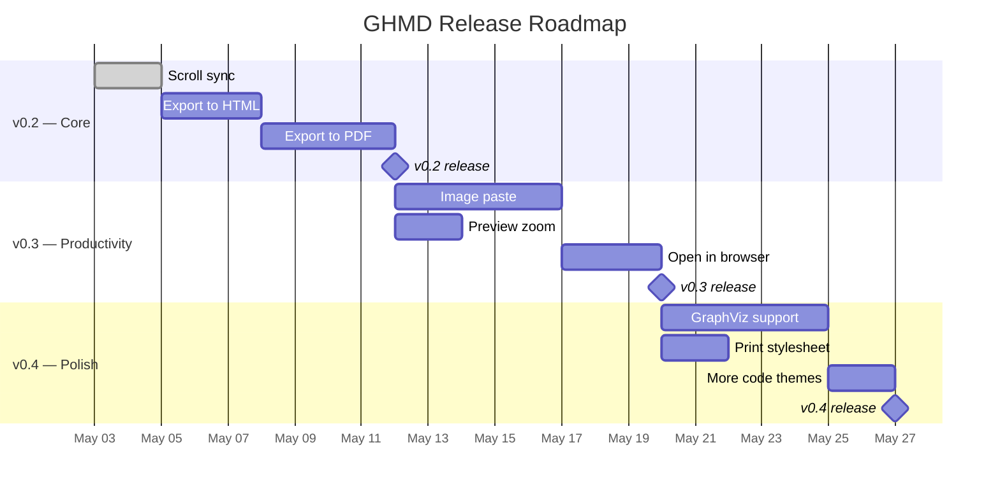

# GHMD Roadmap

> Prioritized feature roadmap for GHMD. Goal: become the best GitHub-accurate markdown previewer with just enough features for daily use.

---

## Guiding Principle

> Build what 80% of users need daily. Skip what 5% of users need occasionally.
>
> Every feature must pass: *"Does this make the daily markdown workflow faster without adding config?"*

---

## Priority Tiers

---

## P0 — Must Have

> [!IMPORTANT]
> These are the features that prevent users from switching to GHMD from MPE. Ship these first.

### Scroll Sync — Done

- [x] Editor-to-preview sync (smooth scroll via `scrollIntoView`)
- [x] Preview-to-editor sync (jump via `revealRange`)
- [x] Source line tracking via renderer wrapper pattern (`src/source-lines.cjs`)
- [x] Feedback loop prevention on both sides (webview + extension host)
- [x] Client-side scroll handling (`src/scroll-sync.js`)

**Implementation:** Renderer wrapper pattern — snapshot existing renderers after all plugins register, wrap each with `data-source-line` injection via regex on first opening tag. See [design doc](./scroll-sync-design-v2.md).

> [!NOTE]
> Editor scroll is instant (VS Code API limitation — `revealRange` has no smooth scroll). Preview scroll is smooth (`scrollIntoView` with `behavior: 'smooth'`).

### Export to HTML

- [ ] Command: `GHMD: Export to HTML`
- [ ] Self-contained single file (all CSS/JS inlined)
- [ ] Preserve current theme (light/dark)
- [ ] Include KaTeX CSS + fonts as base64
- [ ] Include Mermaid JS (or pre-render SVGs)
- [ ] Output to same directory as source `.md`

**Approach:** Reuse existing `html()` generation from `serve.mjs`. Strip live-reload script, inline all assets.

### Export to PDF

- [ ] Command: `GHMD: Export to PDF`
- [ ] Use Puppeteer/Chrome headless for rendering
- [ ] Auto-detect Chrome path (macOS, Linux, Windows)
- [ ] Configurable page size (A4 default) and margins
- [ ] Support `@media print` CSS for page breaks
- [ ] Graceful error if Chrome not found

> [!NOTE]
> PDF export depends on HTML export — build HTML export first, then pipe through Puppeteer.

---

## P1 — Should Have

### Image Paste

- [ ] <kbd>Cmd</kbd>+<kbd>V</kbd> pastes clipboard image into markdown
- [ ] Save image to configurable folder (default: `./assets/`)
- [ ] Insert `` at cursor
- [ ] Generate unique filenames (timestamp-based)
- [ ] Support PNG and JPEG from clipboard

### Preview Zoom

- [ ] <kbd>Cmd</kbd>+<kbd>=</kbd> zoom in
- [ ] <kbd>Cmd</kbd>+<kbd>-</kbd> zoom out
- [ ] <kbd>Cmd</kbd>+<kbd>0</kbd> reset zoom
- [ ] Persist zoom level per session
- [ ] Apply CSS `transform: scale()` on `.ghmd-wrapper`

### Open in Browser

- [ ] Command: `GHMD: Open in Browser`
- [ ] Launch `serve.mjs` with the current file
- [ ] Open default browser automatically
- [ ] Reuse existing server if same file
- [ ] Kill server when VS Code closes

---

## P2 — Nice to Have

### Additional Diagram Support

Diagram types to consider

| Diagram | Library | Bundle Size | Value |
|---------|---------|:-----------:|:-----:|
| GraphViz | Viz.js (WASM) | ~1.5 MB | High — widely used in docs |
| PlantUML | plantuml-encoder + server | Tiny (server-side) | Medium — needs Java or server |
| D2 | d2 CLI | External | Low — niche adoption |

**Recommendation:** Add GraphViz via Viz.js only. It covers class diagrams, network topologies, and dependency graphs that Mermaid handles poorly.

- [ ] GraphViz / `dot` code block rendering via Viz.js
- [ ] Fallback to Kroki server for unsupported diagram types

### More Code Themes

- [ ] Add 3-4 popular themes beyond GitHub light/dark
- [ ] Setting: `ghmd.codeTheme` with autocomplete

### Print Stylesheet

- [ ] `@media print` CSS for browser print (<kbd>Cmd</kbd>+<kbd>P</kbd>)
- [ ] Hide toolbar and TOC in print
- [ ] Page break hints via `<!-- pagebreak -->` syntax

### File Watcher Improvements

- [ ] Watch `@import`-ed files for changes (if we add import support)
- [ ] Debounce rapid saves (configurable, default 300ms)

---

## PX — Won't Do

> [!CAUTION]
> These features are explicitly out of scope. They add complexity without matching GHMD's mission.

| Feature | Reason |
|---------|--------|
| Code chunk execution | Security risk, niche use case, Jupyter territory |
| reveal.js presentations | Separate tool (Slidev, Marp) |
| eBook export (ePub/Mobi) | Calibre/Pandoc do it better |
| Multiple parser engines | Over-engineering; marked is sufficient |
| Wiki links / CriticMarkup | Tiny user base |
| 17+ preview themes | GHMD's value IS GitHub fidelity |
| Parser extension hooks | Extensibility for extensibility's sake |
| Image upload to imgur/sm.ms | Separate tool territory |
| Custom editor registration | Too invasive for a previewer |

---

## Release Plan

---

## Progress Tracker

### v0.2 — Core

- [x] Scroll sync (editor → preview)
- [x] Scroll sync (preview → editor)
- [ ] Export to self-contained HTML
- [ ] Export to PDF via Chrome headless
- [ ] Tests for new features
- [x] Update README

### v0.3 — Productivity

- [ ] Image paste from clipboard
- [ ] Preview zoom controls
- [ ] Open current file in browser via `serve.mjs`
- [ ] Tests for new features
- [ ] Update README

### v0.4 — Polish

- [ ] GraphViz diagram rendering
- [ ] Print stylesheet
- [ ] Additional code highlight themes
- [ ] Performance audit (large files)
- [ ] Publish to VS Code Marketplace

---

## Success Criteria

| Metric | Target |
|--------|--------|
| VSIX size | < 3 MB |
| Time to first preview | < 500ms |
| Scroll sync latency | < 50ms |
| Config options | < 10 |
| GitHub rendering accuracy | 100% for supported features[^1] |

[^1]: "Supported features" = GFM + alerts + footnotes + math + mermaid + code highlighting + diff + task lists + `<kbd>` + `
` + `<picture>`. GHMD should render these identically to github.com.
